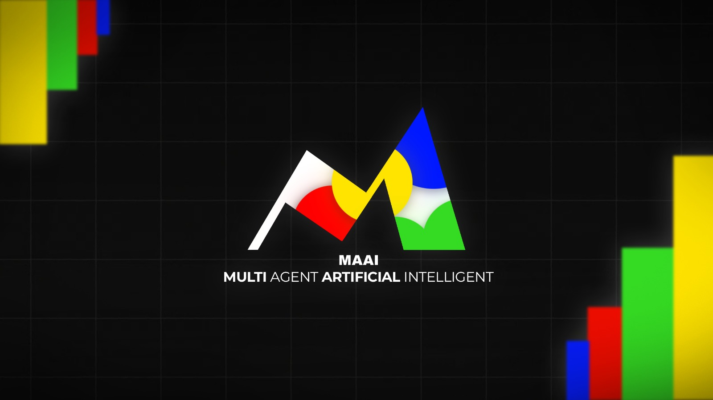

# MAAI: Multi-Agent Coding CLI Application


[](https://opensource.org/licenses/MIT) <!-- Optional: Add a license badge if applicable -->

## Overview

MAAI is a command-line application that leverages a multi-agent system to take a simple software idea from conception through research, analysis, design, implementation, testing, and documentation. Each agent specializes in a specific part of the software development lifecycle, collaborating within a project structure to build and refine the final product.

The application aims to automate and streamline the process of turning high-level software ideas into functional, tested, and documented code.

## Features

*   **Multi-Agent System:** Utilizes specialized agents (Innovator, Architect, Coder, Reviewer, Tester, Documenter, MarketAnalyst, ResearchAgent, BusinessAgent, ScoringAgent, IdeaGenAgent) for different development tasks.
*   **End-to-End Automation:** Manages the software lifecycle from idea generation to documentation.
*   **CLI Control:** Provides a command-line interface for managing projects and triggering agents/pipelines.
*   **Structured Projects:** Organizes all generated artifacts (code, tests, docs) within a dedicated `projects/` directory for each idea.
*   **Automated Environment:** Handles dependency extraction (`requirements.txt`), virtual environment creation (`.venv/`), and installation during the build process.
*   **AI-Powered:** Leverages Generative AI (e.g., Google Gemini) for core agent functionalities.

## Installation & Setup

1.  **Prerequisites:**
    *   Python 3.9+

2.  **Clone the Repository (if applicable):**
    ```bash
    git clone <your-repo-url>
    cd maai
    ```

3.  **Install Dependencies:**
    ```bash
    pip install -r requirements.txt
    ```

4.  **Configure API Key:**
    *   Create a `.env` file in the root directory.
    *   Add your Generative AI API key:
        ```
        GEMINI_API_KEY=YOUR_API_KEY_HERE
        ```
    *   *(Note: Replace `GEMINI_API_KEY` if using a different provider as configured in `config.yaml`)*

5.  **Review Configuration:**
    *   Check the `config.yaml` file for model settings and other configurations.

## Usage

MAAI is controlled via the `src/main.py` script. Use `python src/main.py --help` for a full list of commands and options. Most commands require specifying a project name using `--project <name>`.

Here are some common commands:

**1. List Projects:**

```bash
python src/main.py --list
```
Lists all existing projects in the configured projects directory.

**2. Create a New Project Idea:**

```bash
python src/main.py --idea "A brief description of your software idea" [--project <name>] [--wild]
# Example: python src/main.py --idea "A CLI tool for basic image format conversion"
```
Generates a project name (if not provided), creates the directory structure in `projects/`, and runs the Innovator Agent to create `docs/idea.md`. The `--wild` flag enables an innovative and futuristic prompt.

**3. Generate Ideas based on a Subject:**

```bash
python src/main.py --subject "Your subject here" --subject-name <name> --num-ideas <number> [--wild]
# Example: python src/main.py --subject "AI-powered tools" --subject-name ai_tools --num-ideas 10
```
Uses the IdeaGenAgent to generate a list of project ideas based on a given subject and saves them to a JSON file. Requires `--subject-name` and `--num-ideas`. The `--wild` flag enables an innovative and futuristic prompt.

**4. Process Bulk Ideas from a File:**

```bash
python src/main.py --bulk <path_to_json_file> [--wild]
# Example: python src/main.py --bulk ideas.json
```
Processes a JSON file containing multiple ideas, creating a project, generating business and scoring documents for each. The `--wild` flag enables an innovative and futuristic prompt for idea processing.

**5. Generate Tasks List:**

```bash
python src/main.py --tasks --project <your-project-name>
```
Generates a tasks document (`docs/tasks.md`) for the specified project based on the idea.md.

**6. Generate Tests:**

```bash
python src/main.py --tests --project <your-project-name>
```
Generates testing code for the project's source code.

**7. Generate Diagrams:**

```bash
python src/main.py --diagrams --project <your-project-name>
```
Generates diagrams for the project's source code and documents.

**8. Generate Business Perspective:**

```bash
python src/main.py --business --project <your-project-name>
```
Runs the BusinessAgent to generate a business perspective document (`docs/business.md`) for the specified project.

**9. Generate Scoring Report:**

```bash
python src/main.py --scoring --project <your-project-name>
```
Runs the ScoringAgent to generate a scoring report (`docs/scoring.md`) for the specified project.

**10. Perform Technical Research:**

```bash
python src/main.py --research --project <your-project-name>
```
Runs the ResearchAgent to perform technical research based on the project idea and saves the summary to `docs/research_summary.md`.

**11. Perform Market Analysis:**

```bash
python src/main.py --analyze --project <your-project-name>
```
Runs the MarketAnalystAgent to analyze the market potential of the project idea and saves the analysis to `docs/market_analysis.md`.

**12. Generate Architecture for Features:**

```bash
python src/main.py --build-features --project <your-project-name>
# Example: python src/main.py --build-features --project a-cli-tool-for-basic-image...
```
Runs the Architect Agent to generate architecture docs from existing feature files (`features*.md`) for all features. Generates files like `impl_[feature]_[component]*.md`.

**13. Enhance Features Architecture:**

```bash
python src/main.py --enhance-features --project <your-project-name>
# Example: python src/main.py --enhance-features --project a-cli-tool-for-basic-image...
```
Runs the Architect Agent to generate feature documents (`feature_*.md`) from the main idea document (`idea.md`).

**14. Generate or Update Code:**

```bash
python src/main.py --code --project <your-project-name>
# Example: python src/main.py --code --project a-cli-tool-for-basic-image...
```
Runs the Coder Agent to generate code based on the implementation plans (`impl_*.md`).

**15. Review Code:**

```bash
python src/main.py --review --project <your-project-name>
```
Runs the Reviewer Agent to review the generated code and create `docs/review.md` if issues are found.

**16. Generate Specific Documentation:**

```bash
python src/main.py --docs <type> --project <your-project-name>
# Supported types: api, project_overview, sdd, srs, user_manual
# Example: python src/main.py --docs api --project a-cli-tool-for-basic-image...
```
Runs the Documenter Agent to generate a specific documentation file.

## Agent Roles

Based on src/main.py, the agents are:

*   **InnovatorAgent:** Generates and expands ideas.
*   **ArchitectAgent:** Designs implementation plans.
*   **CoderAgent:** Generates or updates code.
*   **ReviewerAgent:** Reviews code.
*   **TesterAgent:** Generates tests.
*   **DocumenterAgent:** Generates documentation.
*   **MarketAnalystAgent:** Performs market analysis.
*   **ResearchAgent:** Performs research.
*   **BusinessAgent:** Generates business perspectives.
*   **ScoringAgent:** Generates scoring reports.
*   **IdeaGenAgent:** Generates lists of ideas.
*   **TasksAgent:** Generates tasks lists.
*   **DiagramAgent:** Generates diagrams.

## Contributing

Just contribute - don't make mess :-)

## License

MIT License.
