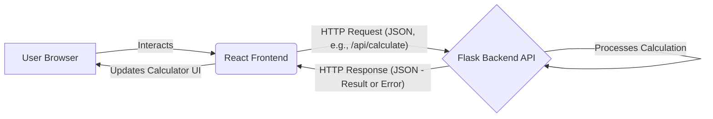

```markdown
# Project Documentation: Kid-Friendly Web Calculator (Pink Edition)

## 1. Project Overview

This project provides a simple, engaging, and visually appealing web-based calculator designed specifically for young children (ages 4-8). Recognizing that standard calculators can be uninteresting or intimidating for kids, this application offers a fun, intuitive interface focused on making basic arithmetic practice enjoyable.

The initial version features a **prominent pink color palette and related themes**, specifically tailored to appeal to young girls. The core goal is to be a free, accessible tool that helps children practice addition (+), subtraction (-), multiplication (*), and division (/) in a playful, motivating environment.

The application is built using React for the frontend user interface and Python/Flask for the backend API, ensuring a modern and scalable foundation.

## 2. Features

*   **Basic Arithmetic Operations:** Supports addition, subtraction, multiplication, and division.
*   **Pink-Themed Kid-Friendly Interface:** Features large, easy-to-click buttons, clear number displays, and a vibrant **pink color scheme** designed to be visually appealing and engaging for young children, especially girls. The layout is simple and avoids the complexity of scientific calculators.
*   **Clear Input & Result Display:** Shows the numbers being entered and the final calculation result prominently.
*   **Visual Feedback:** Provides immediate visual cues when buttons are pressed.
*   **Simple Error Handling:** Displays gentle, non-technical error messages for invalid operations (e.g., "Oops! Can't divide by zero!").
*   **Easy Clear Function:** A clearly marked "Clear" (C or AC) button resets the current calculation.
*   **Responsive Design:** Adapts to different screen sizes, working well on desktops and tablets commonly used by children.
*   **(Optional) Sound Effects:** Includes simple, fun sounds for button presses and results, with an option to mute.

## 3. Getting Started / Usage

This application consists of a frontend (React) and a backend (Flask). To run it locally, you'll need Node.js (with npm or yarn) and Python 3.9+ (with pip) installed.

**Prerequisites:**

*   Node.js and npm/yarn (for Frontend)
*   Python 3.9+ and pip (for Backend)
*   Git (for cloning the repository)

**Installation & Running:**

1.  **Clone the repository:**
    ```bash
    git clone <repository-url>
    cd kid-calculator
    ```

2.  **Set up and run the Backend:**
    ```bash
    cd backend
    # Create a virtual environment (recommended)
    python -m venv venv
    source venv/bin/activate  # On Windows use `venv\Scripts\activate`
    # Install dependencies
    pip install -r requirements.txt
    # Run the Flask development server (from the backend directory)
    # Might require setting FLASK_APP=src/app.py depending on setup
    flask run
    ```
    The backend API should now be running, typically on `http://127.0.0.1:5000`.

3.  **Set up and run the Frontend:**
    ```bash
    cd ../frontend
    # Install dependencies
    npm install  # or yarn install
    # Start the React development server
    npm start    # or yarn start
    ```
    The frontend application should automatically open in your default web browser, typically at `http://localhost:3000`.

**Usage:**

*   Open the application URL (e.g., `http://localhost:3000`) in your web browser.
*   Use your mouse or touchscreen to click the large, colorful buttons to input numbers and select operations (+, -, *, /).
*   The display will show your current input.
*   Press the '=' button to see the calculation result.
*   Press the 'C' or 'AC' button to clear the current input or the entire calculation.
*   If sound effects are enabled, you'll hear sounds on button presses. Use the mute toggle if available to turn sounds off/on.

## 4. Architecture Overview

The Kid-Friendly Calculator is structured as a standard web application with separate frontend and backend components:

*   **Frontend (React):** A Single-Page Application (SPA) built with React.js. It is responsible for:
    *   Rendering the calculator interface (display, buttons).
    *   Handling user clicks and interactions.
    *   Managing the application's state (current number, selected operation, display value).
    *   Performing basic client-side calculations for immediate feedback or sending calculation requests to the backend API.
    *   Applying the specific **pink-themed** styling using CSS.
*   **Backend (Flask):** A lightweight API built with Python and the Flask microframework. It is responsible for:
    *   Providing an API endpoint (e.g., `/api/calculate`) to handle calculation requests from the frontend.
    *   Performing the core calculation logic.
    *   Returning results or error messages (like division by zero) to the frontend in JSON format.
    *   Using `Flask-CORS` to allow communication from the frontend during development.

**Interaction Flow:**


*(Note: For basic arithmetic, calculations might be handled entirely within the React frontend for faster feedback, with the backend API primarily serving as a scalable foundation for future features.)*

## 5. Configuration

Configuration for the frontend and backend is managed primarily through environment variables.

*   **Backend:** Look for a `.env.example` file in the `backend/` directory. Copy it to a `.env` file and modify any necessary variables (though the basic version might not require specific backend configuration beyond standard Flask settings).
*   **Frontend:** Look for a `.env.example` file in the `frontend/` directory. Copy it to a `.env` file. This might contain variables like `REACT_APP_API_BASE_URL` to specify where the frontend should send requests to the backend API (e.g., `REACT_APP_API_BASE_URL=http://127.0.0.1:5000/api`).

For basic local running, the default settings provided in the development servers might suffice without needing extensive `.env` configuration.

## 6. Troubleshooting

*   **Installation Issues:**
    *   Ensure you have the correct versions of Node.js and Python installed.
    *   Make sure `pip` and `npm`/`yarn` are available in your PATH.
    *   If dependency installation fails, check error messages for conflicts or missing system libraries. Try removing `node_modules` / `venv` and reinstalling.
*   **Backend Not Starting:**
    *   Check the terminal output for error messages (e.g., port conflicts, Python errors).
    *   Ensure you have activated the virtual environment (`venv`) before running `pip install` and `flask run`.
    *   Make sure `requirements.txt` was installed correctly.
*   **Frontend Not Connecting to Backend:**
    *   Verify the backend server is running.
    *   Check the browser's developer console (usually F12) for network errors (e.g., 404 Not Found, CORS errors).
    *   Ensure the `REACT_APP_API_BASE_URL` in the frontend's `.env` file (if used) points to the correct backend address and port.
    *   Confirm that `Flask-CORS` is correctly configured on the backend to allow requests from the frontend's origin (e.g., `http://localhost:3000`).
*   **Calculator Errors ("Error" on Display):**
    *   The calculator should display simple messages like "Oops! Can't divide by zero!".
    *   If you see a generic "Error", check the browser console and backend logs for more details. This might indicate an unexpected issue. Reset the calculator using the Clear button.
```